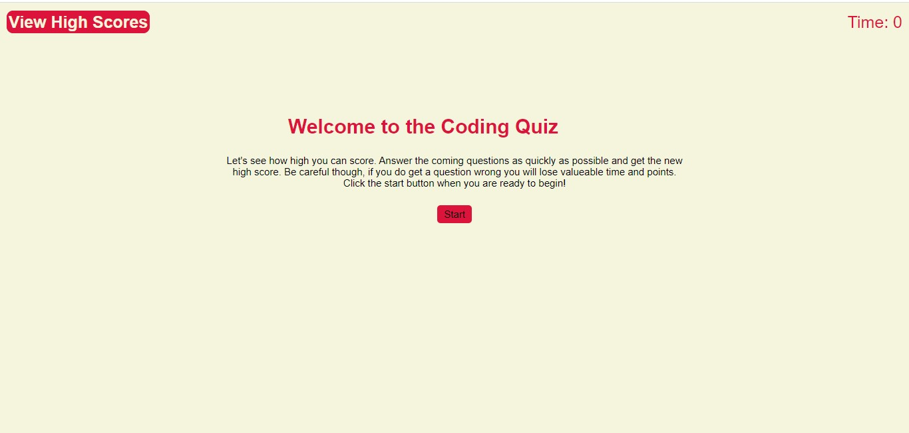
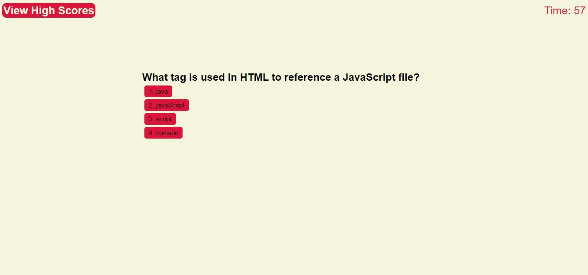
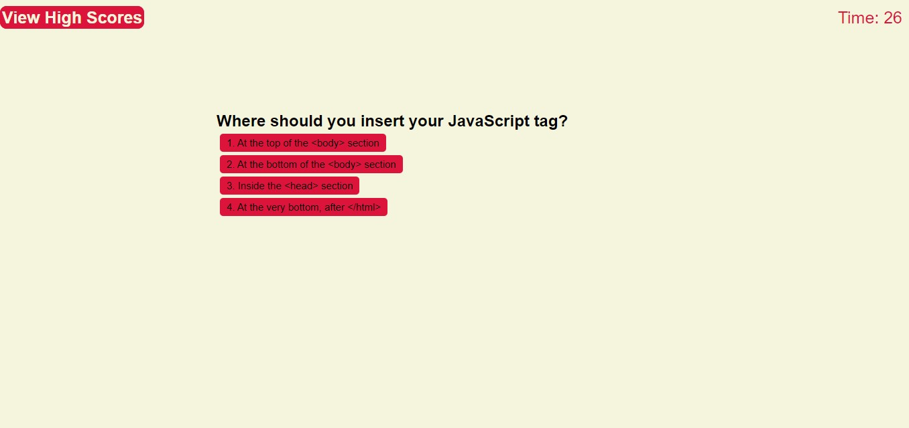
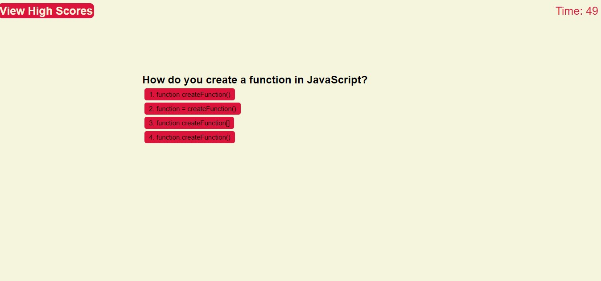
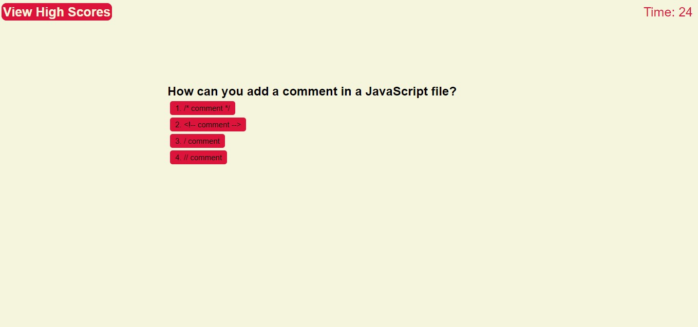
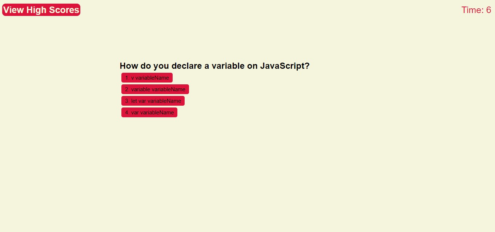
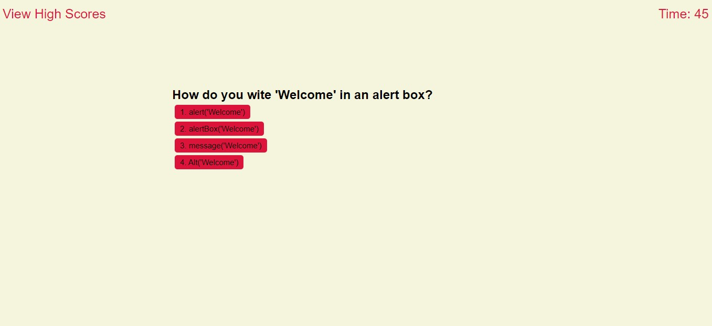
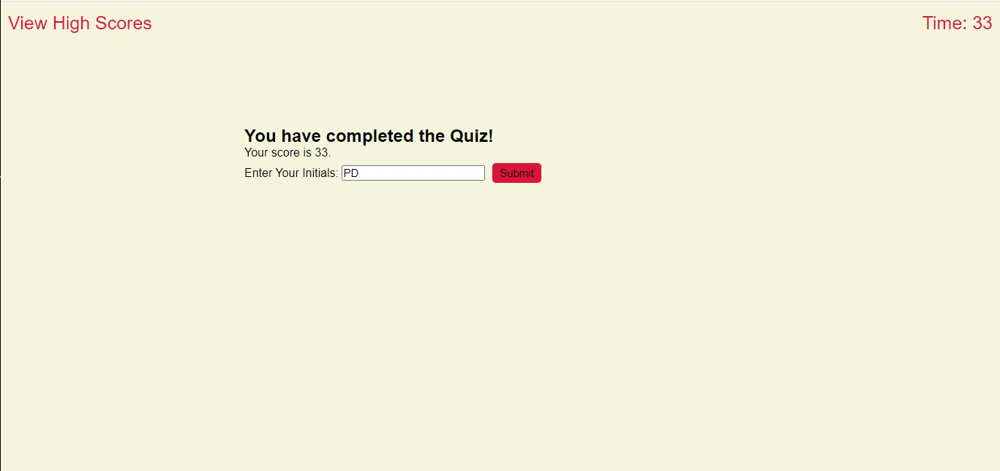
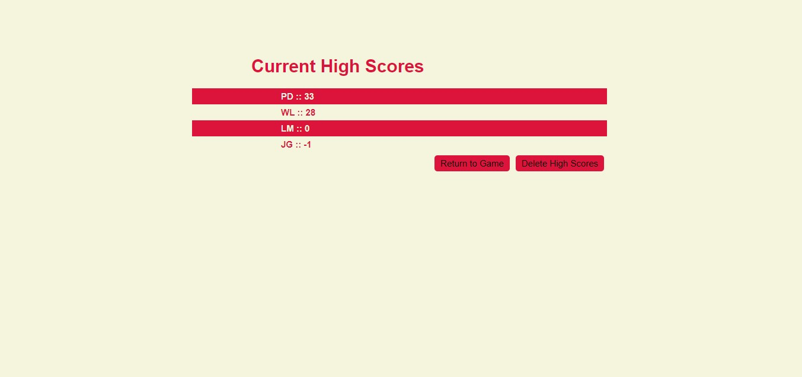
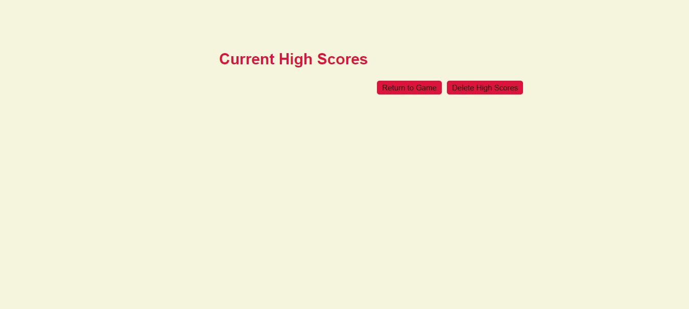

## Coding Quiz

Quiz created by Jorge Garit

Click [here](https://jorgegarit.github.io/code-quiz/index.html) to view the Quiz Home Screen. 
Click [here](https://jorgegarit.github.io/code-quiz/highscores.html) to view the High Scores Page.

### Home Screen 
The Home Screen contains a link to view high scores, which will take you to the high scores page. It also includes a timer which is set to zero until the game is started. 
In the center you will find the main header of the pages with a short description of the game and a button that will start the game once clicked. 

### Questions

Once the start button is clicked you will be prompted with a questions followed by 4 possible answer, in the meantime the time, starting at 60 seconds, is slowly counting down. 
If the time reaches zero the quiz will end and you will be taken to the submit score screen. 

There are a total of 6 questions and a reduction of 10 seconds will be dealt for each question that is answer wrong. Your final score will be based on the amount of seconds you have remaining after the 6 questions are answered. When a question is answered correctly a prompt will appear stating so, the prompt will also state when a question is answered incorrectly. At anytime you can exit the quiz by either reloading the page or clicking the View High Scores Link on the top right. Below are screenshots of the 6 questions. 

### Submit Score Screen

After you have finished the quiz or ran out of time you will be given a final score based on the remaining time. at that point you can add your initials and click on the submit button to store your score to the localStorage. Once you hit submit you will then be taken to the high scores page.

### High Scores Page

The High Scores page includes a list of the current high scores with the player initials in decending order. It also includes a return to game button that will take you back to the homescreen; as well as a delete high scores button which will delete the scores that have been saved to the local storage and will then reload the page. 

This is a screenshot of the high scores page showing current scores!

This is a screenhsot of the high scores page once the scores have been deleted!

#### Hope you enjoy this Quiz 🤓